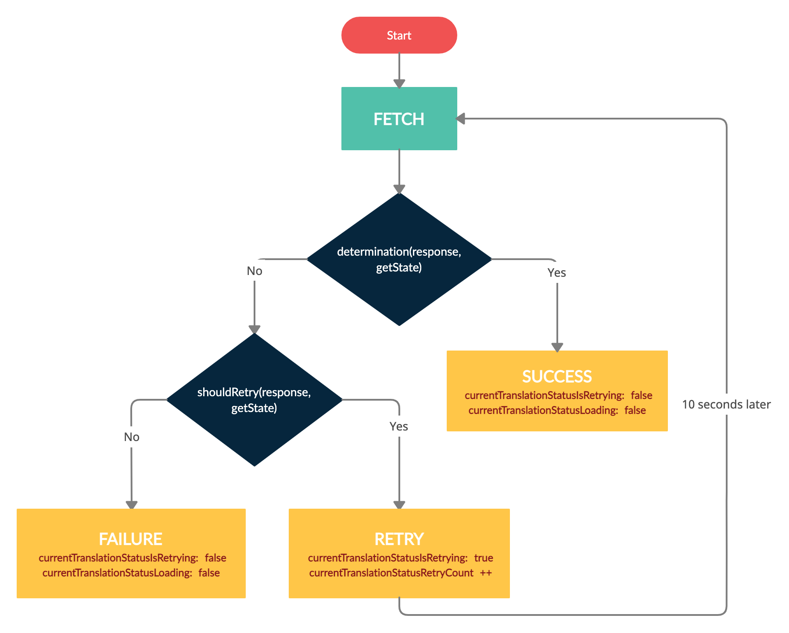

# Basic polling recipe

Imagine you have to translate a PDF. In order to translate it, you will upload it to a server in order for it translate and create a new URL where you can fetch the new translated PDF.
If file is still being processed, the server will respond with a [202 status code](https://developer.mozilla.org/en-US/docs/Web/HTTP/Status/202). Once the PDF has finished processing, the server will respond with a 200 status code and the response body will include a URL where you can download the new PDF.

Let's define a service using [`apisauce`](https://github.com/infinitered/apisauce).

```js
const getTranslationStatus = (translationID) => api.get('translation_status', { translationID });
```

First we complete the state:
```js
const completedState = completeState({ pollingTargets: { currentTranslationStatus: null } });
```

Then we complete our polling types:
```js
export const actions = createTypes(
  completeTypes({
    pollingActions: ['FETCH_TRANSLATION_STATUS']
  }),
  '@@TRANSLATIONS'
);

const actionCreators = {
  getTranslationStatus: (translationID) => ({
    type: actions.FETCH_TRANSLATION_STATUS,
    target: 'currentTranslationStatus',
    service: getTranslationStatus,
    payload: translationID,
    determination: (response, getState) => response.status === 200, // the server responds with 200 when it has finished processing
    shouldRetry: response => response.status === 202, // if the server responds with 202, then it is still processing and we should ask again in a while
    timeout: 10000, // we want to wait 10 seconds before retrying each time
  })
};
```

We need to complete the reducer as well:
```js
const reducerDescription = {
  pollingActions: [actions.FETCH_PAYMENT_DATA]
};
const reducer = createReducer(INITIAL_STATE, completeReducer(reducerDescription));
```

Now we just dispatch the action to start polling:
```js
dispatch(actionCreators.getTranslationStatus(myTranslationID));
```

Once you dispatch the polling action, your state will begin changing like this:

- `currentTranslationStatus`: will have the status once the polling ends successfully.
- `currentTranslationStatusError`: will have the error once the polling ends unsuccessfully.
- `currentTranslationStatusLoading`: will be set to `true` when a request has been made but the response hasn't come yet.
- `currentTranslationStatusIsRetrying`: will be `true` if, after the first request, `shouldRetry` determined the polling must continue. This flag will be set back to `false` once the polling ends.
- `currentTranslationStatusRetryCount`: The amount of times a request has been sent (including the first one).
- `targetTimeoutID`: This timeout ID is used to cancel the polling prematurely.

If the server responds with a `202`, you'll see `currentTranslationStatusRetryCount` increase and `currentTranslationStatusLoading` toggle back and forth as the subsequent requests are fired.

If at any time the server responds with a `200`, `currentTranslationStatus` will hold the server response and `currentTranslationStatusIsRetrying` will be set to `false`. This marks the polling as being over.

If at any time the server responds with any other HTTP status, `currentTranslationStatusError` will hold the server response and `currentTranslationStatusIsRetrying` will be set to `false`. This also marks the polling as being over.

Here's a diagram to help you further understand how the polling works


## Basic polling recipe with retries limit

You can add an easy limit to the number of retries with:
```js
const actionCreators = {
  getTranslationStatus: (translationID) => ({
    type: actions.FETCH_TRANSLATION_STATUS,
    target: 'currentTranslationStatus',
    service: getTranslationStatus,
    payload: translationID,
    determination: (response, getState) => response.status === 200,
    shouldRetry: (response, getState) => response.status === 202 && getState().currentTranslationStatusRetryCount < 10, // only try 10 times
  })
};
```
After the 10th request, failure path of the diagram will be followed.

## Cancelling polling
You can cancel the polling at any time with:
```js
dispatch({type: actions.FETCH_PAYMENT_DATA_CANCEL, target: 'currentTranslationStatus'});
```

## Demo
You can try out a [demo](https://codesandbox.io/s/89eic) in order to improve your understanding of polling actions. We recommend using you own browser's console instead of `codesandbox.ios`'s.
